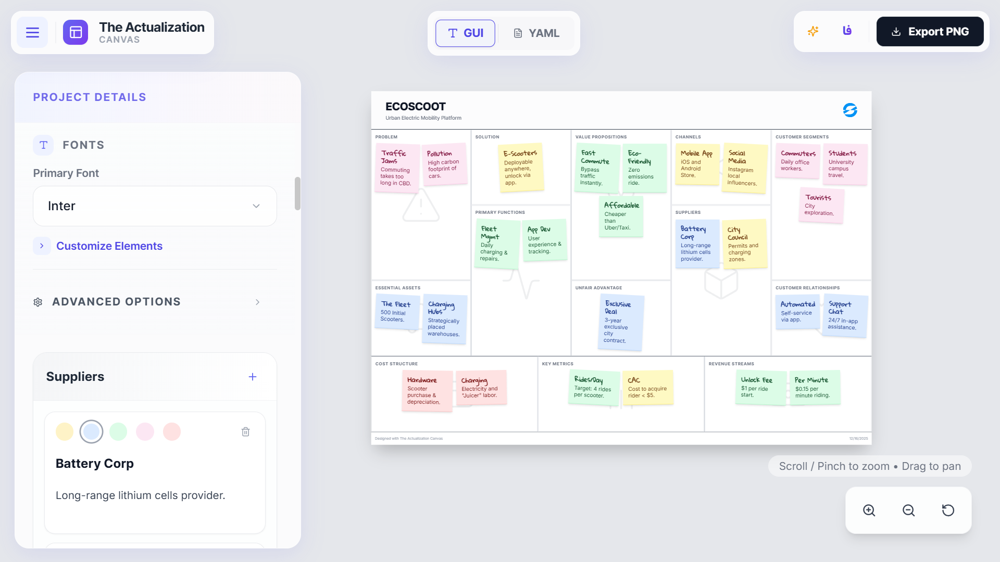

# Actualization Canvas

**Actualization Canvas** is a powerful, interactive tool designed for creating, managing, and visualizing business models and strategic plans. Built with modern web technologies, it offers a dual-mode editing experience (GUI and YAML) and real-time canvas previewing, making it easier than ever to bring your ideas to life.



## Features

- **Interactive Canvas**: Real-time visualization of your business model canvas.
- **Dual Editing Modes**:
  - **GUI Editor**: User-friendly form-based inputs for easy editing.
  - **YAML Editor**: Direct YAML editing for power users and rapid data manipulation.
- **Internationalization (i18n)**: Full support for English and Persian (Farsi), including RTL (Right-to-Left) layout adjustments.
- **Responsive Design**: Optimized for Desktop, Tablet, and Mobile devices with adaptive sidebar and control bars.
- **Export Capabilities**: High-quality PNG export of your canvas for presentations and sharing.
- **Customization**:
  - Change canvas patterns (dots, lines, etc.).
  - Adjust fonts (supports Vazirmatn for Persian).
  - Sticky note styling.

## Tech Stack

This project is built using the following technologies:

- **Framework**: [Next.js 15](https://nextjs.org/) (App Router)
- **Library**: [React 18](https://react.dev/)
- **Styling**: [Tailwind CSS](https://tailwindcss.com/)
- **Language**: [TypeScript](https://www.typescriptlang.org/)
- **State Management & Data**: Custom Hooks, [js-yaml](https://github.com/nodeca/js-yaml)
- **Canvas Interaction**: [react-zoom-pan-pinch](https://github.com/prc5/react-zoom-pan-pinch)
- **Exporting**: [@zumer/snapdom](https://github.com/zumerlab/snapdom)
- **Testing**: [Jest](https://jestjs.io/) & [Playwright](https://playwright.dev/)
- **Linting & Formatting**: ESLint, Prettier, Husky, Commitlint

## Getting Started

### Prerequisites

Ensure you have the following installed:

- Node.js (v18 or higher recommended)
- npm or pnpm

### Installation

1. **Clone the repository:**

   ```bash
   git clone https://github.com/your-username/actualization-canvas.git
   cd actualization-canvas
   ```

2. **Install dependencies:**

   ```bash
   npm install
   # or
   pnpm install
   ```

3. **Prepare Husky (for pre-commit hooks):**
   ```bash
   npm run prepare
   ```

### Running the Application

Start the development server:

```bash
npm run dev
```

Open [http://localhost:3000](http://localhost:3000) in your browser to see the application.

### Building for Production

To create a production build:

```bash
npm run build
```

To start the production server:

```bash
npm run start
```

## Testing

### Unit Tests

Run unit tests with Jest:

```bash
npm run test
```

### End-to-End (E2E) Tests

Run E2E tests with Playwright:

```bash
npm run test:e2e
```

## Project Structure

```
src/
├── app/               # Next.js App Router pages and layouts
├── components/        # Reusable UI components (Header, Sidebar, Canvas, etc.)
├── constants/         # Application constants and default data
├── hooks/             # Custom React hooks (useCanvasData, etc.)
├── types/             # TypeScript type definitions
├── utils/             # Helper functions
└── ...
```

## Contributing

Contributions are welcome! See [CONTRIBUTING](CONTRIBUTING.md)

## License

[MIT](LICENSE)
